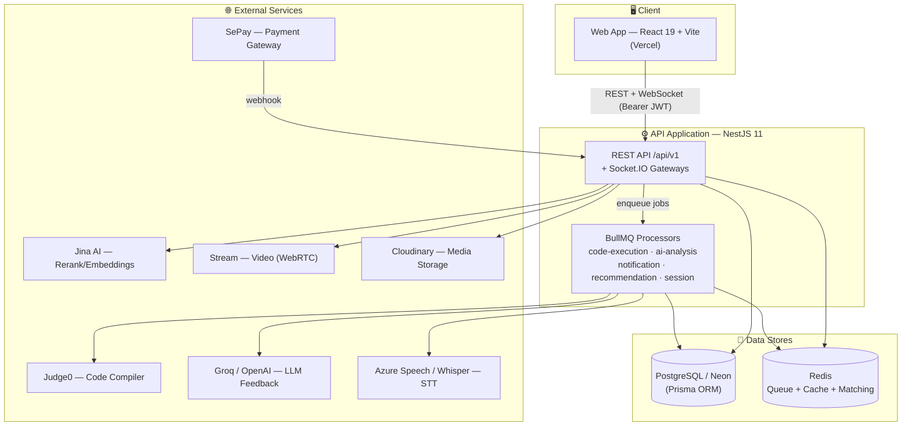
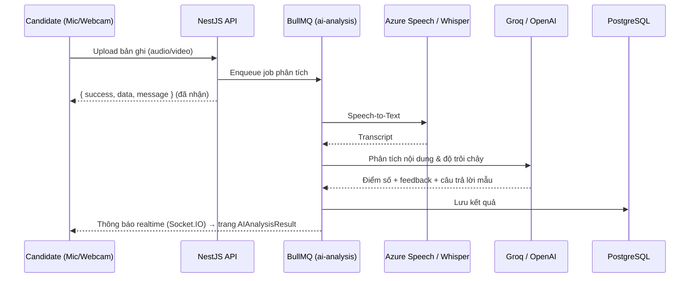
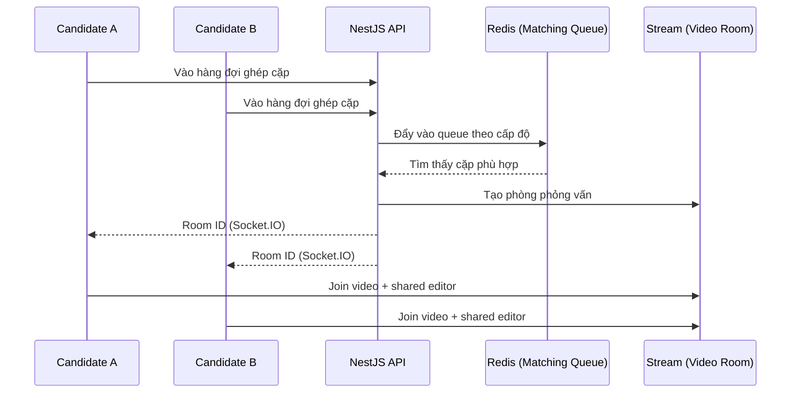
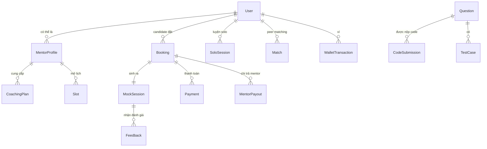
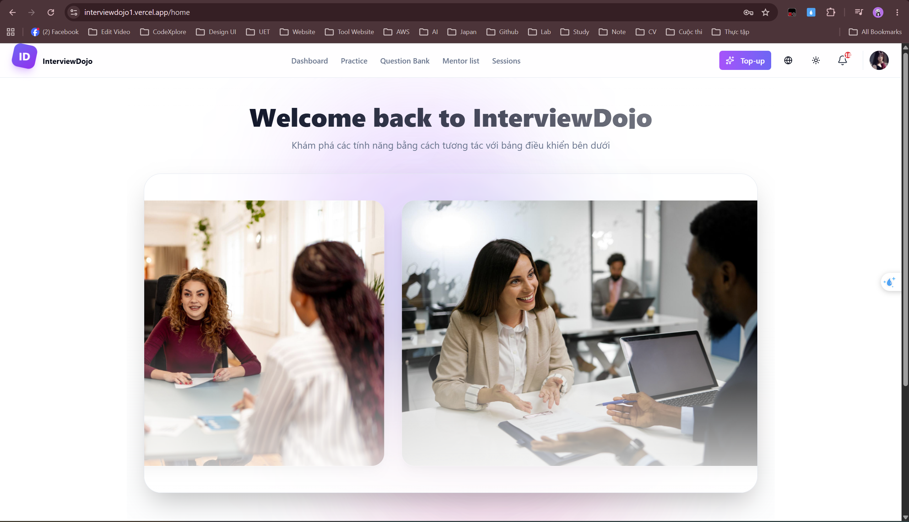
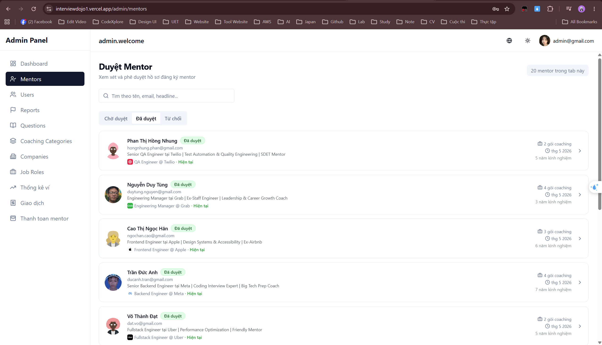
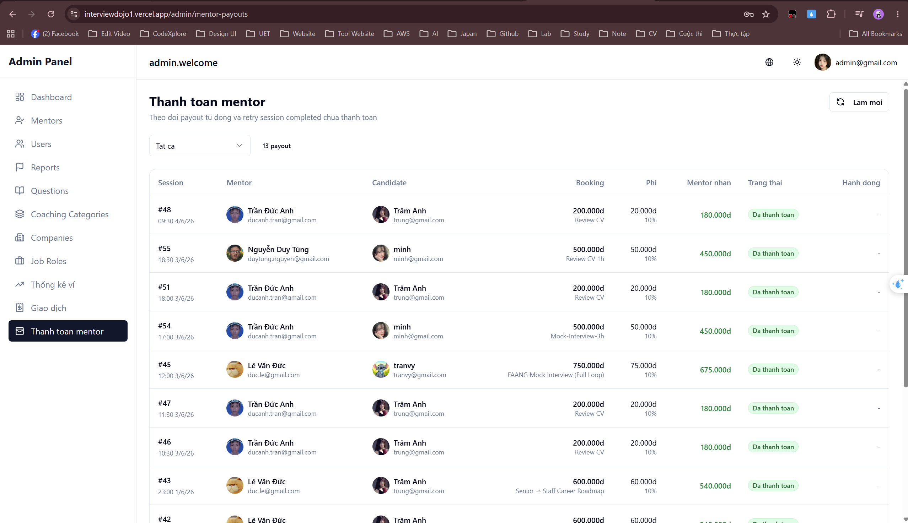

<div align="center">

# 🥋 InterviewDojo

**Nền tảng luyện phỏng vấn kỹ thuật trực tuyến — kết hợp AI, Phỏng vấn chéo (Peer) và Chuyên gia (Mentor).**

[](https://nestjs.com/)
[](https://react.dev/)
[](https://vitejs.dev/)
[](https://www.typescriptlang.org/)
[](https://www.prisma.io/)
[](https://neon.tech/)
[](https://redis.io/)

[🚀 Live Demo](https://interviewdojo1.vercel.app/login) · [🎬 Video Demo](https://drive.google.com/file/d/1eGLN7Z1Zpk4jmnbGp7C44GIWlK2Gy_Te/view?usp=drive_link) · [Báo lỗi](https://github.com/kimmttrung/InterviewDojo/issues) · [Đề xuất tính năng](https://github.com/kimmttrung/InterviewDojo/issues)

</div>

---

> ### 🌐 Dùng thử ngay
>
> **URL:** https://interviewdojo1.vercel.app/login
>
> **Tài khoản test:** `trung@gmail.com` · **Mật khẩu:** `123456`
>
> ⏳ **Vui lòng đợi ~2–3 phút ở lần truy cập đầu tiên.** Backend chạy trên gói miễn phí nên sẽ **"ngủ" khi không có người dùng**; request đầu tiên phải đánh thức server (cold start). Sau khi server đã khởi động, mọi thao tác sẽ phản hồi bình thường.

> ### 🎬 Xem video demo
>
> 👉 **[Nhấn để xem video demo đầy đủ (Google Drive)](https://drive.google.com/file/d/1eGLN7Z1Zpk4jmnbGp7C44GIWlK2Gy_Te/view?usp=drive_link)**
>
> Video giới thiệu tổng quan luồng sử dụng: luyện tập Solo AI, phỏng vấn chéo, đặt lịch mentor và trang quản trị.

---

## 📑 Mục lục

- [1. Tổng quan dự án](#1--tổng-quan-dự-án)
- [2. Cấu trúc chức năng](#2--cấu-trúc-chức-năng)
- [3. Kiến trúc hệ thống](#3--kiến-trúc-hệ-thống)
- [4. Công nghệ sử dụng (Tech Stack)](#4--công-nghệ-sử-dụng-tech-stack)
- [5. Mô hình dữ liệu & Thiết kế](#5--mô-hình-dữ-liệu--thiết-kế)
- [6. Cấu trúc thư mục](#6--cấu-trúc-thư-mục)
- [7. Các module cốt lõi](#7--các-module-cốt-lõi)
- [8. Cài đặt & Chạy dự án](#8--cài-đặt--chạy-dự-án)
- [9. Cấu hình & Biến môi trường](#9--cấu-hình--biến-môi-trường)
- [10. API](#10--api)
- [11. Kiểm thử (Testing)](#11--kiểm-thử-testing)
- [12. Yêu cầu phi chức năng](#12--yêu-cầu-phi-chức-năng)
- [13. Triển khai (Deployment)](#13--triển-khai-deployment)
- [14. Quy trình đóng góp](#14--quy-trình-đóng-góp)
- [15. Lộ trình phát triển](#15--lộ-trình-phát-triển)
- [16. Ảnh chụp màn hình](#16--ảnh-chụp-màn-hình)
- [17. Giấy phép](#17--giấy-phép)

---

## 1. 🎯 Tổng quan dự án

### 1.1. Bối cảnh & Vấn đề

Sinh viên IT mới ra trường thường gặp "khoảng trống" giữa kiến thức học thuật và kỹ năng phỏng vấn thực tế:

- **Tâm lý:** Thiếu tự tin, áp lực khi đối mặt với người phỏng vấn.
- **Kinh nghiệm:** Thiếu môi trường thực chiến để cọ xát câu hỏi chuyên môn (DSA, System Design).
- **Phản hồi:** Không có người định hướng hay đánh giá đúng/sai sau khi trả lời.

### 1.2. Giải pháp — 3 trụ cột luyện tập

InterviewDojo xây dựng một hệ sinh thái toàn diện giúp ứng viên nâng cao kỹ năng qua **3 trụ cột**:

| Trụ cột | Mô tả |
| ------- | ----- |
| 🤖 **Solo Practice** | Tự luyện với AI: ghi âm/ghi hình → chuyển giọng nói thành văn bản (STT) → AI phân tích nội dung & độ trôi chảy → gợi ý câu trả lời mẫu. |
| 👥 **Peer Matching** | Phỏng vấn chéo giữa những người cùng cấp độ; thuật toán ghép cặp dựa trên hàng đợi (Redis). |
| 🎓 **Mentor Booking** | Đặt lịch phỏng vấn 1-1 với chuyên gia qua video call để nhận nhận xét chuyên sâu. |

### 1.3. Đối tượng người dùng

| Vai trò | Chức năng chính |
| ------- | --------------- |
| 🧑‍💻 **Candidate** | Luyện tập Solo/Peer/Mentor, giải câu hỏi trong Question Bank, đặt lịch mentor, nạp & thanh toán qua ví. |
| 🧑‍🏫 **Mentor** | Quản lý lịch rảnh, tạo gói coaching, duyệt booking, chạy buổi phỏng vấn, nhận thanh toán (payout). |
| 🛡️ **Admin** | Duyệt hồ sơ mentor, kiểm duyệt báo cáo, quản lý ngân hàng câu hỏi, giám sát ví & payout. |

---

## 2. 🧩 Cấu trúc chức năng

### 2.1. Nhóm chức năng cho Ứng viên (Candidate)

<details open>
<summary><b>Xem chi tiết</b></summary>

- 📚 **Ngân hàng câu hỏi (Question Bank):** duyệt câu hỏi theo **Category** (Frontend, Backend, Big Data…), **Level/Difficulty**, gắn **Công ty** và **Job Role**.
- 🤖 **Luyện tập Solo với AI:** ghi âm/ghi hình câu trả lời → STT (Azure Speech / Whisper) → LLM phân tích và chấm điểm → trang kết quả `AIAnalysisResult`.
- 👥 **Phỏng vấn chéo (Peer):** vào hàng đợi ghép cặp (Redis) → được đưa vào phòng phỏng vấn realtime.
- 🎓 **Đặt lịch Mentor:** tìm mentor theo kỹ năng/giá → đặt gói coaching → phỏng vấn 1-1 qua video (Stream).
- 💻 **Giải code trực tuyến:** trình soạn thảo **Monaco Editor**, chạy/nộp bài qua **Judge0** (biên dịch online).
- 🔖 **Bookmark:** lưu câu hỏi để làm sau.
- 💳 **Ví (Wallet):** nạp tiền và thanh toán buổi mentor.
- 📊 **Dashboard & Báo cáo:** theo dõi tiến độ luyện tập qua biểu đồ (Recharts).

</details>

### 2.2. Nhóm chức năng cho Mentor & Quản trị

<details>
<summary><b>Mentor</b></summary>

- 🗓️ Quản lý lịch rảnh (**Slot / Availability**) và sự kiện bị chặn (Blocked Event).
- 📦 Tạo & quản lý **gói coaching** (CV review, mock interview, roadmap…).
- 📋 Duyệt/quản lý **booking** và các buổi session.
- 💰 Theo dõi ví và nhận **payout tự động** sau buổi hoàn thành.

</details>

<details>
<summary><b>Admin / Staff</b></summary>

- ✅ **Duyệt mentor:** xem xét & phê duyệt/từ chối hồ sơ đăng ký mentor.
- 👤 **Quản lý người dùng.**
- 🚩 **Reports & Moderation:** xử lý báo cáo vi phạm kèm nhật ký kiểm duyệt (Moderation Log).
- 📚 **Quản lý ngân hàng câu hỏi**, category, công ty, job role, coaching category.
- 💵 **Thống kê ví, giao dịch & thanh toán mentor (payout):** phí nền tảng mặc định **10%** (`PLATFORM_FEE_PERCENT`).

</details>

---

## 3. 🏗️ Kiến trúc hệ thống

### 3.1. Mô hình Modular Monolith

Dự án được thiết kế theo hướng **Modular Monolith** để cân bằng giữa tốc độ phát triển và khả năng mở rộng:

- **Tính đóng gói:** backend chia thành ~40 module theo domain (Auth, Questions, Coding, Matching, Booking, Session, Wallet, Payment, Notifications…), dễ quản lý và bảo trì.
- **Khả năng mở rộng:** các tác vụ nặng (chấm code, phân tích AI, gửi thông báo) được đẩy vào **hàng đợi BullMQ (Redis)** để xử lý bất đồng bộ — sẵn sàng tách thành microservice khi cần.

### 3.2. Sơ đồ C4 — Level 2 (Container Diagram)



### 3.3. Quy trình xử lý dữ liệu chính

**Luồng Solo AI (chấm điểm bất đồng bộ):**



**Luồng Peer Matching:**



### 3.4. Hành vi xuyên suốt (Cross-cutting) của Backend

| Cơ chế | Mô tả |
| ------ | ----- |
| **Response envelope** | Mọi response thành công được `TransformInterceptor` bọc thành `{ success, data, message }`. Controller chỉ trả về data thô. |
| **Validation** | `ValidationPipe` toàn cục với `whitelist: true` + `transform: true` (loại bỏ field lạ). |
| **Auth** | JWT (Passport) với **access + refresh token**; phân quyền theo role `CANDIDATE` / `MENTOR` / `ADMIN`. |
| **Async** | Tác vụ nặng đẩy vào BullMQ queue (Redis), không xử lý inline. |
| **Realtime** | Socket.IO gateways cho matching, thông báo, phiên phỏng vấn trực tiếp. |
| **Error handling** | `AllExceptionsFilter` chuẩn hoá lỗi toàn cục. |

---

## 4. 🧰 Công nghệ sử dụng (Tech Stack)

### Frontend
| Hạng mục | Công nghệ |
| -------- | --------- |
| Framework | React 19, Vite 7, TypeScript |
| Routing | react-router-dom v7 (`ProtectedRoute` chặn theo role) |
| Server state | TanStack Query |
| Client state | Zustand |
| UI | Tailwind CSS, Radix UI (kiểu shadcn), class-variance-authority, lucide-react, framer-motion |
| Form | react-hook-form + Zod |
| Code editor | Monaco Editor (`@monaco-editor/react`) |
| Video | `@stream-io/video-react-sdk` |
| Biểu đồ | Recharts |
| i18n | i18next / react-i18next |

### Backend
| Hạng mục | Công nghệ |
| -------- | --------- |
| Framework | NestJS 11, TypeScript |
| ORM / DB | Prisma 7 → PostgreSQL (Neon) |
| Auth | `@nestjs/jwt`, Passport, `passport-jwt`, bcrypt |
| Queue | BullMQ + Redis (`ioredis`) |
| Realtime | Socket.IO (`@nestjs/websockets`, `platform-socket.io`) |
| Lịch/Event | `@nestjs/schedule`, `@nestjs/event-emitter` |
| API docs | Swagger (`@nestjs/swagger`) |
| Validation | class-validator, class-transformer |

### AI / Media / Bên thứ ba
| Hạng mục | Công nghệ |
| -------- | --------- |
| LLM | **Groq** (`groq-sdk`, mặc định `llama-3.3-70b-versatile`), OpenAI (`openai`) |
| Speech-to-Text | Azure Speech SDK (`microsoft-cognitiveservices-speech-sdk`), Whisper (`backend/scripts/transcribe_whisper.py`) |
| Rerank/Embeddings | **Jina AI** (`infrastructure/jina`) — phục vụ gợi ý mentor |
| Code Execution | **Judge0** (qua RapidAPI) |
| Video (WebRTC) | **Stream** (`@stream-io/node-sdk`) |
| Lưu trữ media | **Cloudinary** (video, CV, avatar) |
| Thanh toán | **SePay** (webhook) |
| Xử lý audio/video | FFmpeg (`ffmpeg-static`) |

### DevOps & Công cụ
| Hạng mục | Công nghệ |
| -------- | --------- |
| E2E test | Playwright + Allure |
| Unit test | Jest (backend) |
| Lint/Format | ESLint, Prettier |
| Git hooks | Husky + lint-staged + commitlint (Conventional Commits) |
| CI | GitHub Actions (tạo Neon branch riêng mỗi PR + Redis service) |
| Hosting | Vercel (frontend) · Neon (PostgreSQL) |

---

## 5. 🗃️ Mô hình dữ liệu & Thiết kế

Schema Prisma tại [`backend/prisma/schema.prisma`](backend/prisma/schema.prisma) (~60 model & enum). Các thực thể trọng tâm:



| Thực thể | Vai trò |
| -------- | ------- |
| **User** | Candidate / Mentor / Admin (role-based). |
| **MentorProfile / CoachingPlan / Slot** | Hồ sơ mentor, gói coaching, lịch rảnh. |
| **Question / CodingQuestion / TheoryQuestion / TestCase / CodeSubmission** | Ngân hàng câu hỏi & bài nộp code. |
| **Booking / MockSession / SoloSession / MeetSession / Match** | Các loại buổi phỏng vấn & ghép cặp. |
| **Payment / WalletTransaction / MentorPayout** | Ví, giao dịch, chi trả mentor. |
| **Feedback / UserReport / ModerationLog / Notification** | Đánh giá, báo cáo, kiểm duyệt, thông báo. |

> 📌 **Lưu ý dữ liệu:** cả `@prisma/client` và `typeorm` đều có trong dependencies, nhưng **tầng dữ liệu đang hoạt động là Prisma** (`PrismaModule`). Hãy ưu tiên Prisma cho code mới.

---

## 6. 📁 Cấu trúc thư mục

```
InterviewDojo/
├── backend/                 # NestJS 11 API (package.json / node_modules riêng)
│   ├── src/
│   │   ├── modules/         # ~40 module theo domain (xem mục 7)
│   │   ├── common/          # interceptors, decorators, filters, constants, utils
│   │   ├── config/          # bull.config.ts (BullMQ)
│   │   ├── prisma/          # PrismaModule + PrismaService
│   │   ├── infrastructure/  # tích hợp ngoài (jina)
│   │   ├── app.module.ts    # nơi ráp toàn bộ module
│   │   └── main.ts          # bootstrap, prefix api/v1, Swagger
│   ├── prisma/              # schema.prisma + migrations + seed-*.ts
│   └── scripts/             # transcribe_whisper.py
├── frontend/                # React 19 + Vite SPA (package.json / node_modules riêng)
│   └── src/
│       ├── app/             # App.tsx (routes) + main.tsx (providers)
│       ├── features/        # feature slices (candidate, mentor, admin, session, wallet…)
│       ├── shared/          # component/ui dùng chung, i18n, utils
│       ├── stores/          # Zustand stores
│       └── contexts/        # React contexts (ThemeContext…)
├── tests/                   # Playwright E2E (e2e/ + pages/ POM + auth.setup.ts)
├── scripts/                 # manage-neon.ts
├── docs/screenshots/        # ảnh cho README
├── .github/workflows/ci.yml # pipeline CI
├── playwright.config.ts
├── prisma.config.ts
└── docker-compose.yml       # (placeholder Redis — xem mục Deployment)
```

> ⚠️ Mỗi package cài đặt riêng. Chạy `npm install` ở root **không** cài dependencies cho `backend/` hay `frontend/`.

---

## 7. 🧱 Các module cốt lõi

Backend theo mô hình **module-per-domain** dưới `backend/src/modules/`:

| Module | Trách nhiệm |
| ------ | ----------- |
| `auth` | Xác thực JWT (access/refresh) & phân quyền theo role |
| `user` | Tài khoản & hồ sơ người dùng |
| `mentor` / `mentor-payout` | Hồ sơ mentor, phê duyệt, và **payout tự động** |
| `booking` / `slot` / `plan` / `coaching-category` | Lịch rảnh, gói coaching, đặt lịch |
| `payment` / `wallet` | Nạp ví, giao dịch, webhook thanh toán (SePay) |
| `questions` / `coding` / `code-engine` | Ngân hàng câu hỏi, câu hỏi code, thực thi code qua Judge0 |
| `session` / `matching` / `meeting` | Buổi phỏng vấn, ghép cặp peer, phòng meeting trực tiếp |
| `solo-recording` / `ai-analysis` / `ai-summary` | Solo AI: ghi âm, STT, phân tích/chấm điểm |
| `mentor-recommendation` | Gợi ý mentor (dùng Jina rerank) |
| `notifications` / `socket` | Thông báo & Socket.IO gateway realtime |
| `admin` / `reports` | Trang quản trị & kiểm duyệt báo cáo |
| `categories` / `companies` / `job-roles` / `skill` / `target-role` | Taxonomy & metadata |
| `cloudinary` / `stream` / `redis` | Tích hợp dịch vụ ngoài |

Mỗi module thường gồm `*.module.ts`, `*.controller.ts`, `*.service.ts`, `dto/`, `entities/`, cùng `*.processor.ts` (worker queue) và `*.gateway.ts` (WebSocket) khi cần.

---

## 8. 🚀 Cài đặt & Chạy dự án

### Yêu cầu môi trường

- **Node.js 20+** (CI dùng Node 20)
- **PostgreSQL** (khuyến nghị một branch [Neon](https://neon.tech/))
- **Redis** (cho BullMQ queue & cache)
- Khóa API của các dịch vụ ngoài (xem [mục 9](#9--cấu-hình--biến-môi-trường))

### Bước 1 — Clone

```bash
git clone https://github.com/kimmttrung/InterviewDojo.git
cd InterviewDojo
```

### Bước 2 — Cài dependencies (từng package)

```bash
npm install                        # tooling ở root (Playwright, Prisma CLI, Husky)
cd backend && npm install && cd ..
cd frontend && npm install && cd ..
```

### Bước 3 — Thiết lập cơ sở dữ liệu (Prisma)

```bash
cd backend
npx prisma generate
npx prisma migrate deploy          # hoặc: npx prisma migrate dev
```

Seed dữ liệu (tuỳ chọn):

```bash
npm run db:seed                    # seed staging
npm run db:seed-mentor             # mentor
npm run db:seed-solo-questions     # câu hỏi solo
```

### Bước 4 — Chạy local

```bash
# Terminal 1 — Backend (http://localhost:3000, Swagger tại /api/docs)
cd backend && npm run start:dev

# Terminal 2 — Frontend (http://localhost:5173)
cd frontend && npm run dev
```

---

## 9. ⚙️ Cấu hình & Biến môi trường

Backend nạp cấu hình qua `@nestjs/config` (global). Các biến dưới đây **được xác nhận trực tiếp từ mã nguồn**:

### Core
| Biến | Dùng ở | Mô tả |
| ---- | ------ | ----- |
| `DATABASE_URL` | Prisma | Chuỗi kết nối PostgreSQL. **Bắt buộc** (config root sẽ throw nếu thiếu). |
| `REDIS_URL` | BullMQ, Redis module, `bull.config.ts` | Chuỗi kết nối Redis. |
| `PORT` | `main.ts` | Cổng API (mặc định `3000`). |
| `NODE_ENV` | `payment.service` | Môi trường chạy. |

### Xác thực (JWT)
| Biến | Mô tả |
| ---- | ----- |
| `JWT_ACCESS_SECRET` | Secret ký access token. |
| `JWT_REFRESH_SECRET` | Secret ký refresh token. |

### AI & Speech
| Biến | Mô tả |
| ---- | ----- |
| `GROQ_API_KEY` | Khóa Groq (LLM chính). |
| `GROQ_MODEL` | Model Groq (mặc định `llama-3.3-70b-versatile`). |
| `JINA_API_KEY` | Khóa Jina AI (rerank/embeddings). |

### Code Execution — Judge0
| Biến | Mô tả |
| ---- | ----- |
| `JUDGE0_URL` | Endpoint Judge0. |
| `JUDGE0_KEY` | `x-rapidapi-key`. |
| `JUDGE0_HOST` | `x-rapidapi-host`. |

### Video & Media
| Biến | Mô tả |
| ---- | ----- |
| `STREAM_API_KEY` / `STREAM_SECRET_KEY` | Stream (video WebRTC). |
| `CLOUDINARY_NAME` / `CLOUDINARY_API_KEY` / `CLOUDINARY_API_SECRET` | Cloudinary (lưu media). |

### Thanh toán & Vận hành
| Biến | Mô tả |
| ---- | ----- |
| `SEPAY_WEBHOOK_SECRET` | Secret xác thực webhook SePay. |
| `PLATFORM_FEE_PERCENT` | Phần trăm phí nền tảng khi payout mentor (mặc định `10`). |

### CI (dùng trong GitHub Actions)
`NEON_PROJECT_ID`, `NEON_API_KEY`, `JWT_SECRET`, `REDIS_HOST`, `REDIS_PORT`.

> ℹ️ **TODO:** Repo chưa có file `.env.example` được commit. Nên bổ sung một file `.env.example` tổng hợp đầy đủ các biến trên để onboarding dễ dàng và tái lập được.

### Các file cấu hình

| File | Mục đích |
| ---- | -------- |
| `backend/prisma/schema.prisma` | Schema DB (model & enum) |
| `backend/prisma.config.ts` / `prisma.config.ts` | Wiring Prisma schema & datasource |
| `backend/src/config/bull.config.ts` | Kết nối BullMQ/Redis |
| `frontend/vite.config.ts` | Build Vite & alias `@` → `src` |
| `frontend/vercel.json` | Rewrite SPA cho Vercel |
| `playwright.config.ts` | Cấu hình E2E & auth state |
| `commitlint.config.cjs` | Bắt buộc Conventional Commits |

---

## 10. 🔌 API

- **Base URL:** `/api/v1` (prefix toàn cục trong `main.ts`).
- **Auth:** `Bearer <JWT>` (Passport JWT; role `CANDIDATE` / `MENTOR` / `ADMIN`).
- **Response envelope:**

```json
{ "success": true, "data": {  }, "message": "..." }
```

- **Tài liệu tương tác:** **Swagger UI** tại `http://localhost:3000/api/docs` (tiêu đề _InterviewDojo API_).

Các endpoint được tổ chức theo từng domain module (auth, users, mentors, bookings, wallet, questions, coding, sessions, notifications, admin, reports…). Xem Swagger để có danh sách đầy đủ và luôn cập nhật.

---

## 11. 🧪 Kiểm thử (Testing)

| Lớp | Công cụ | Ghi chú |
| --- | ------- | ------- |
| Unit / Integration (backend) | **Jest** | Spec khớp `src/**/*.(spec\|integration-spec).ts`. Coverage chỉ thu từ `src/modules/**/*.service.ts` với ngưỡng **100%** (branches/functions/lines/statements) cho các file được tính — xem `collectCoverageFrom` trong `backend/package.json`. |
| E2E | **Playwright** | Page Object Model trong `tests/pages/`; project `setup` đăng nhập một lần và lưu state ở `.auth/user.json`; kết quả xuất **Allure**. |

```bash
# Backend: unit test + coverage
cd backend && npm run test:cov

# Chạy 1 file spec cụ thể
npm run test -- src/modules/auth/auth.service.spec.ts

# E2E (cần frontend chạy :5173 và backend đang chạy)
npm run test:e2e
npm run report:allure
```

**CI** (`.github/workflows/ci.yml`) chạy khi có PR tới `main` / `develop`: khởi tạo Redis service + một **Neon branch riêng cho mỗi PR**, chạy Prisma generate/migrate, rồi chạy unit test backend. (Bước build frontend và Playwright E2E hiện đang bị comment.)

---

## 12. 🛡️ Yêu cầu phi chức năng (Non-Functional Requirements)

| Tiêu chí | Mục tiêu |
| -------- | -------- |
| ⚡ **Hiệu năng** | Độ trễ video call thấp; thời gian phản hồi AI feedback trong ngưỡng chấp nhận được (xử lý bất đồng bộ qua queue để không chặn request). |
| 🔒 **Bảo mật** | Bản ghi video được lưu trữ có kiểm soát; phân quyền truy cập nghiêm ngặt theo role; JWT access/refresh. |
| ♻️ **Độ tin cậy** | Dùng hàng đợi Redis (BullMQ) để đảm bảo không mất dữ liệu khi tác vụ AI/chấm code quá tải. |
| 🌍 **Trải nghiệm** | Giao diện đa ngôn ngữ (i18next) và hỗ trợ chế độ sáng/tối. |

> _Các con số SLA cụ thể (ví dụ độ trễ < 200ms, phản hồi AI < 10s) là **mục tiêu thiết kế** trong tài liệu dự án và chưa được kiểm chứng bằng benchmark trong repo._

---

## 13. 🚢 Triển khai (Deployment)

| Thành phần | Nền tảng | Ghi chú |
| ---------- | -------- | ------- |
| Frontend | **Vercel** | Rewrite SPA qua `frontend/vercel.json`. Live: [interviewdojo1.vercel.app](https://interviewdojo1.vercel.app/login). |
| Database | **Neon** (PostgreSQL) | Branch-per-PR trong CI; quản lý qua `scripts/manage-neon.ts`. |
| Backend | Node host (gói free) | Chạy `npm run start:prod`. ⚠️ Ngủ khi rảnh → cold start 2–3 phút ở request đầu. |
| Redis | Redis instance | Bắt buộc cho BullMQ + cache. |

> `docker-compose.yml` hiện chỉ chứa **placeholder Redis (đang comment)**, chưa phải một stack đa dịch vụ hoàn chỉnh.
>
> **TODO:** Chưa tìm thấy Dockerfile production / docker-compose đầy đủ trong repo.

---

## 14. 🤝 Quy trình đóng góp

1. **Fork** và tạo nhánh tính năng:
   ```bash
   git checkout -b feat/ten-tinh-nang
   ```
2. Tuân theo [mục Development](#11--kiểm-thử-testing); giữ lint/format sạch (Husky chạy tự động khi commit).
3. Viết commit theo **Conventional Commits** (`feat:`, `fix:`, `docs:`…).
4. Bổ sung/cập nhật test — logic service backend cần giữ coverage đầy đủ.
5. Mở **Pull Request** vào `main` (hoặc `develop`); CI sẽ chạy test backend trên Neon branch mới.

### Quy ước code

- TypeScript toàn stack; ESLint + Prettier ép qua lint-staged.
- Backend: controller trả data thô (interceptor tự bọc envelope); dùng DTO `class-validator`.
- Frontend: TanStack Query cho server state, Zustand cho client state, Radix + Tailwind cho UI.
- **Không** bỏ qua response envelope, validation pipe, hay role guard.
- Alias import: `@/*` → `backend/src/*` và `@` → `frontend/src`.
- Một số file backend có **comment tiếng Việt** — hãy giữ đồng nhất với phong cách xung quanh khi chỉnh sửa.

---

## 15. 🗺️ Lộ trình phát triển

> Suy ra từ các bước CI đang bị comment và trạng thái repo — không phải đặc tả tính năng đã chốt.

- [ ] Bật lại **build frontend + Playwright E2E** trong pipeline CI.
- [ ] Publish **Allure report** lên GitHub Pages (đã có sẵn scaffold trong workflow).
- [ ] Thêm file **`.env.example`** tổng hợp mọi khóa dịch vụ.
- [ ] Cung cấp **Docker / docker-compose** cho môi trường dev đầy đủ.
- [ ] Hợp nhất tầng dữ liệu (gỡ `typeorm` chưa dùng, giữ Prisma).

_TODO: Các hạng mục lộ trình khác cần maintainer xác nhận._

---

## 16. 🖼️ Ảnh chụp màn hình

> Thêm file ảnh vào [`docs/screenshots/`](docs/screenshots/) (xem README trong thư mục đó để biết tên file chuẩn).

### Candidate — Trang chủ


### Admin — Duyệt Mentor


### Admin — Thanh toán Mentor (Payout)


### 🎬 Demo
> ▶️ **[Xem video demo đầy đủ trên Google Drive](https://drive.google.com/file/d/1eGLN7Z1Zpk4jmnbGp7C44GIWlK2Gy_Te/view?usp=drive_link)**

---

## 17. 📄 Giấy phép

`backend/package.json` đánh dấu **`UNLICENSED`** và các package ở chế độ `private`. Không tìm thấy file `LICENSE` ở root repo.

**TODO:** Chưa có giấy phép áp dụng cho toàn repo. Nên thêm file `LICENSE` để làm rõ quyền sử dụng.

---

<div align="center">

Xây dựng với ❤️ bằng **NestJS** & **React** · Maintainer: [@kimmttrung](https://github.com/kimmttrung)

</div>
